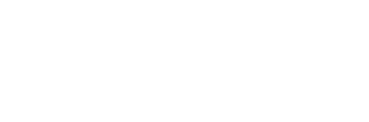
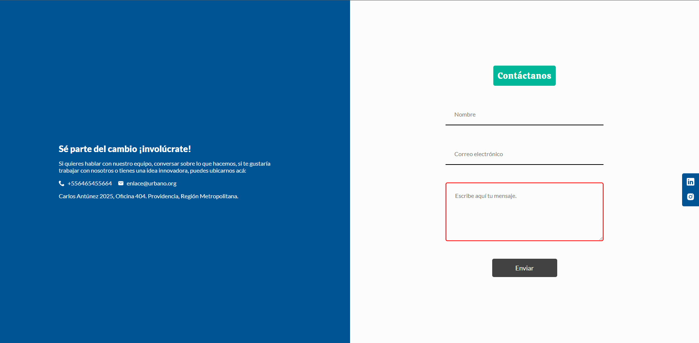

***
## Table of Contents
- [Project Overview](#project-overview)
- [Screenshots](#screenshots)
- [Technologies](#technologies)
  - [Frontend Technologies](#frontend-technologies)
  - [Backend Technologies](#backend-technologies)
- [Installation](#installation)
    - [Backend Installation](#backend-installation)
    - [Frontend Installation](#frontend-installation)
- [Workflow Methodology](#workflow-methodology)
- [Team Members](#team-members)
- [Versions](#versions)

***

## Project Overview
Enlace Urbano is a Chilean NGO that is in charge of developing public works or finding ways for people living in informal settlements or camps (such as favelas) to get help.
This Web Application serves as a point of connection between the aid plans offered by the Chilean government and the people who needs them.

## Screenshots

<table>

<tr>
<td></td>
<td></td>
<td></td>
<td></td>
</tr>
</table>

***

## Technologies

Technologies used for this project

### Frontend Technologies
- React
- Vite
- Typescript 
- NodeJS
- Styled Components
- Axios
- React-Router-DOM
- Jest
- Vitest

### Backend Technologies
- NestJS
- Typescript
- NodeJS
- MongoDB
- Swagger
- Jest

## Installation

### Backend Installation

To install and run the backend of Enlace-Urbano, please follow the steps below:

1- Ensure that you have NestJS 9.0.0 or higher and NodeJS installed on your machine.

2- Clone the [repository from GitHub](https://github.com/Enlace-Urbano/enlace-urbano-back).

3- Navigate to the root directory of the project in your terminal.

4- Run `npm install` to install all the necessary dependencies.

5- Copy the .env.example file to a new file named .env, and update the configuration variables as needed.

6- To start the development server, use the command `npm run dev`. This will start a local development server on http://localhost:4000/.

7- To build the project for production, use the command `npm run build`. To deploy you can use a cloud hosting platform like Railway to host your application.

### Frontend Installation

To install and run the frontend of Enlace-Urbano, please follow the steps below:

1- Ensure that you have Node.js installed on your machine. You can download it from the [official website](https://nodejs.org/en/download/).

2- Clone the [repository from GitHub](https://github.com/Enlace-Urbano/enlace-urbano-front).

3- Navigate to the root directory of the project in your terminal.

4- Run `npm install` to install all the necessary dependencies.

5- To run the development server, use the command `npm run dev`. This will start a local development server on http://localhost:5173/.

6- To build the project for production, use the command `npm run build`. This will create a **dist** directory with the compiled code.

7- To preview the production build, use the command `npm run preview`.

***

## Workflow Methodology
- Agile
- Kanban
- Scrum
- Atomic design
- Pair Programming
- Mob Programming
- SOLID

***

## Team Members

| Name | Role |  |
| :--- | :--- | :--- |
| Galit Bixio |  Product Owner | https://github.com/gbixio |
| Emmanuel Guzmán | Scrum Master | https://github.com/Rguzman77 |
| Alexander Romero | Developer | https://github.com/ChaanChanChan |
| Lautaro Damiani | Developer | https://github.com/talingo |

***
## Versions

- Node.js: v14.16.1
- Npm: 6.14.12
- React: 18.2.0
- NestJS: 9.0.0
