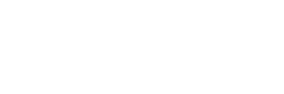

## Project Overview
Enlace Urbano is a Chilean NGO that is in charge of developing public works or finding ways for people living in informal settlements or camps (such as favelas) to get help.
This Web Application serves as a point of connection between the aid plans offered by the Chilean government and the people who needs them.

## Technologies Used

## Workflow Methodology
- Kanban
- Agile with SCRUM
- Pair and solo programming
***

## Team Members

| Name | Role |  |
| :---: | :---: | :---: |
| Galit Bixio |  Product Owner / Lead Designer / Developer | https://github.com/gbixio |
| Alexander Romero | Scrum Master | https://github.com/ChaanChanChan |
| Emmanuel Guzmán | Developer | https://github.com/Rguzman77 |
| Denis Gladarenko | Developer | https://github.com/MyzukaNT |
| Lautaro Damiani | Developer | https://github.com/talingo |